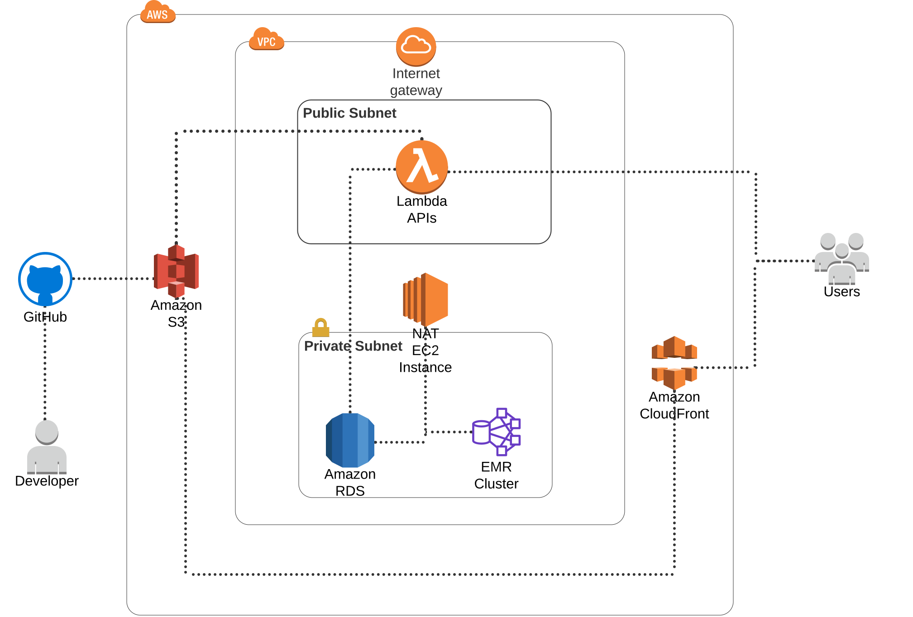

# infra
This contains Terraform code for my personal infrastructure on AWS. The CICD is done with GitHub Actions, which you can see in the Actions tab above.

The lake-freeze sub-module contains resources for my lake ice web application (https://github.com/kgmcquate/lake-freeze-frontend)

